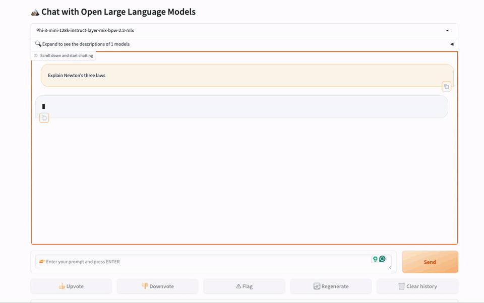

# GBA Model Toolkit for MLX

## Introduction
Welcome to the GreenBitAI (GBA) Model Toolkit for [MLX](https://github.com/ml-explore/mlx)! This comprehensive Python package not only facilitates the conversion of [GreenBitAI's Low-bit Language Models (LLMs)](https://huggingface.co/collections/GreenBitAI/greenbitai-mlx-llm-6614eb6ceb8da657c2b4ed58) to MLX framework compatible format but also supports generation, model loading, and other essential scripts tailored for GBA quantized models. Designed to enhance the integration and deployment of GBA models within the MLX ecosystem, this toolkit enables the efficient execution of GBA models on a variety of platforms, with special optimizations for Apple devices to enable local inference and natural language content generation. 

## Features

This toolkit represents a significant step forward in the usability of GreenBitAI models, making it simpler for developers and researchers to incorporate these models into their MLX-based projects. 

- Conversion: Utilize **gba2mlx.py** to convert models from GBA format to a format compatible with the MLX framework, ensuring smooth integration and optimal performance.
- Generation: Includes scripts for generating content using GBA quantized models within the MLX environment, empowering users to leverage the advanced capabilities of GBA models for natural language content creation.

## Installation
To get started with this package, simply run:
```bash
pip install gbx-lm
```
or clone the repository and install the required dependencies (for Python >= 3.9):
```bash
git clone https://github.com/GreenBitAI/gbx-lm.git
pip install -r requirements.txt
```
Alternatively you can also use the prepared conda environment configuration:
```bash
conda env create -f environment.yml
conda activate gbai_mlx_lm
```

## Usage
### Converting Models
To convert a GreenBitAI's Low-bit LLM to the MLX format, run:
```bash
python -m gbx_lm.gba2mlx --hf-path <input file path or a Hugging Face repo> --mlx-path <output file path> --hf-token <your huggingface token> --upload-repo <a Hugging Face repo name>
```

### Generating Content
To generate natural language content using a converted model:
```bash
python -m gbx_lm.generate --model <path to a converted model or a Hugging Face repo name>
```

## Requirements

- Python 3.x
- See `requirements.txt` or `environment.yml` for a complete list of dependencies

## Examples
In this example, the pretrained 4-bit model "yi-6b-chat-w4a16g128" will be downloaded from [GreenBitAI's Hugging Face repository](https://huggingface.co/collections/GreenBitAI/greenbitai-mlx-llm-6614eb6ceb8da657c2b4ed58) and converted into mlx compatible format, and saved in the local directory "yi-6b-chat-w4a16g128-mlx".
We can also use the "--upload-repo" parameter to provide a Hugging Face repo URL with valid write permissions. This will directly upload the model converted and saved locally to this Hugging Face repo. 
```bash
python -m gbx_lm.gba2mlx --hf-path GreenBitAI/yi-6b-chat-w4a16g128 --mlx-path yi-6b-chat-w4a16g128-mlx/ --hf-token <your huggingface token> --upload-repo GreenBitAI/yi-6b-chat-w4a16g128-mlx
```
It will download and run the local model to generate natural language content through prompts given by users.
```bash
python -m gbx_lm.generate --model GreenBitAI/yi-6b-chat-w4a16g128-mlx  --max-tokens 100 --prompt "calculate 4*8+1024=" --eos-token '<|im_end|>'
```

## Web Demo



We also prepared a demo for deploying chat applications by leveraging the capabilities of FastChat and Gradio.
By following this [instruction](https://github.com/GreenBitAI/gbx-lm/tree/main/gbx_lm/serve), you can quickly build a local chat demo page.

## License
The original code was released under its respective license and copyrights, i.e.:

- `generate.py`, `lora.py`, `*utils.py`, `tuner/*.py` and `models/*.py` released under the [MIT License](https://github.com/ml-explore/mlx-examples/blob/main/LICENSE) in [ml-explore/mlx-examples](https://github.com/ml-explore/mlx-examples/tree/main/llms/mlx_lm).
- We release our changes and additions to these files under the [Apache 2.0 License](LICENSE).
